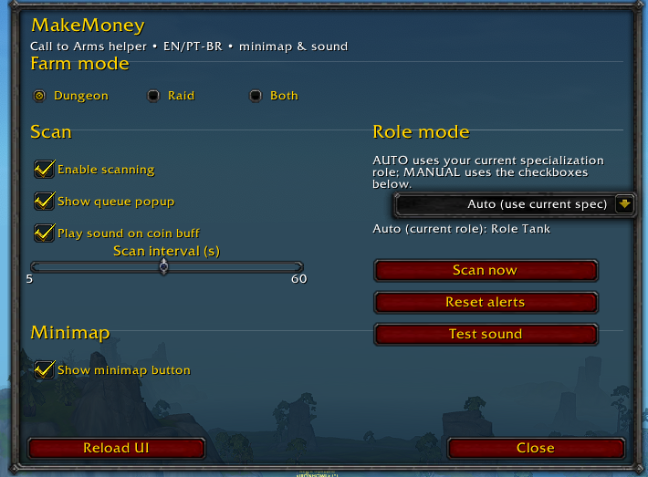
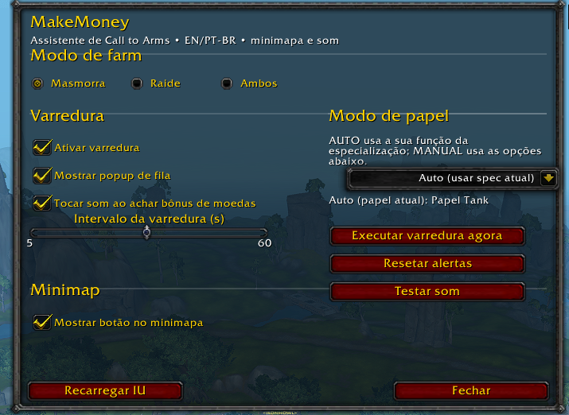

# MakeMoney

A lightweight **Call to Arms** helper that notifies you when there’s a bonus (coin) for **Dungeons** and/or **Raids**.  
Clean UI, **bilingual (EN / PT-BR)**, **minimap icon** with live state (gold when scanning, gray when paused), and **sound alert**.

> Retail compatible (Interface `110000`).  
> SavedVariables: `MakeMoneyDB`.

---

## Table of Contents

- [Installation](#installation)
- [Folder Layout](#folder-layout)
- [Quick Start](#quick-start)
- [Configuration (UI)](#configuration-ui)
- [Minimap Icon](#minimap-icon)
- [Sound](#sound)
- [Localization](#localization)
- [How It Works](#how-it-works)
- [SavedVariables Schema](#savedvariables-schema)
- [Troubleshooting](#troubleshooting)
- [Roadmap / Session 3 – 01 Sep 2025](#roadmap--session-3--01-sep-2025)
- [Credits & License](#credits--license)

---

## Installation

1. Copy the **`MakeMoney`** folder into:
   ```
   World of Warcraft/_retail_/Interface/AddOns/MakeMoney
   ```
2. Ensure the folder name is exactly **MakeMoney**.
3. (Optional, recommended) To have a fully “standard” minimap button, install addons that bundle:
   - `LibStub`, `LibDataBroker-1.1`, `LibDBIcon-1.0`

Run `/reload` after installing.

---

## Folder Layout

```
MakeMoney/
├─ locale/
│  ├─ enUS.lua
│  └─ ptBR.lua
├─ media/
│  ├─ icon_active.tga        # gold (scan ON)
│  ├─ icon_inactive.tga      # gray (scan OFF)
│  └─ cheer.ogg              # default alert sound
├─ MakeMoney.lua             # core (scanner, events, popup)
├─ MakeMoney_UI.lua          # configuration panel (/makemoney)
├─ MakeMoney_Minimap.lua     # minimap button (LDB/LDI + fallback)
└─ MakeMoney.toc
```

---

## Screenshots

<p align="center">
  
  
</p>

---

## Quick Start

- Open the panel: **`/makemoney`**
- Minimap button:
  - **Left click:** addon ping.
  - **Shift + Left click:** toggle scanning (icon switches gold/gray).
  - **Ctrl + Left click:** reset alert throttle.
  - **Right click:** open the panel.

---

## Configuration (UI)

The panel is split into two columns (left = **Scan & Minimap**, right = **Role Mode** + utilities).

### Farm Mode
Limit where the addon searches for Call to Arms:

- **Dungeon**, **Raid**, or **Both**.

### Scan
- **Enable scanning**: master switch.
- **Show queue popup**: opens a dialog with a button to queue.
- **Play sound on coin bonus**: plays `media/cheer.ogg`.
- **Scan interval (s)**: 5–60 seconds between refreshes.
- **Scan now**: force-refresh immediately.
- **Reset alerts**: clears internal throttle so the next discovery can play the sound again.
- **Test sound**: plays your configured sound.

### Role Mode
- **Auto (use current spec):** the addon detects **Tank/Healer/DPS** from your specialization and **hides** the role checkboxes.
- **Manual (choose roles):** shows **Tank**, **Healer**, **DPS** checkboxes under the utility buttons; the scanner only alerts for the roles you tick.

### Minimap
- **Show minimap button**: show/hide.
- **Lock minimap button**: prevent dragging (fallback mode).

**Footer buttons:** **Reload UI** (left) and **Apply & Close** (right).  
The panel also closes with **ESC**.

---

## Minimap Icon

- **Colors**
  - **Gold**: scanning **ON** (`media/icon_active.tga`)
  - **Gray**: scanning **OFF** (`media/icon_inactive.tga`)
- **Behavior**
  - With **LibDBIcon**: icon behaves like other addons (standard ring).
  - Without libs: a small fallback button is placed on the minimap rim; drag with left button.
- **Persistence**: position/visibility are saved in `MakeMoneyDB`.

> To use LibDBIcon automatically, add this to your `.toc`:
> ```
> ## OptionalDeps: LibStub, LibDataBroker-1.1, LibDBIcon-1.0
> ```

---

## Sound

- Default file: `media/cheer.ogg`.
- **Throttle:** the addon avoids replaying the sound for the **same dungeon/raid within 30 seconds**.
- To customize, replace the file and/or set `MakeMoneyDB.sound.file` accordingly.

---

## Localization

- **English (enUS)** and **Portuguese-Brazil (ptBR)** are included.
- To add another language, duplicate one of the locale files and translate the keys.

---

## How It Works

- Core events: `ADDON_LOADED`, `PLAYER_LOGIN`, `LFG_UPDATE_RANDOM_INFO`.
- Scanner:
  - Checks **LFD** (Random Dungeons) when farm mode is not “Raid”.
  - Checks **LFR** (Raid Finder) when farm mode is not “Dungeon”.
  - Uses `GetLFGRoleShortageRewards` to detect **shortage** (coin/items/xp bonus).
  - Respects **Role Mode** (Auto by spec or Manual by checkboxes).
- Alert flow:
  - On match: on-screen line, optional **sound**, `FlashClientIcon()`, and an optional **queue popup** with an **Accept** button.

---

## SavedVariables Schema

```lua
MakeMoneyDB = {
  version = "0.1.0",
  minimap = {
    shown  = true,
    radius = 80,                 -- fallback placement radius
    angle  = 180,                -- fallback placement angle
    lock   = false,
    ldb    = { hide = false, minimapPos = 180 }, -- LibDBIcon state
  },
  scan = {
    active    = true,
    roles     = { TANK=true, HEALER=true, DAMAGER=true },
    onlyFirst = false,           -- (available in core, UI hidden by default)
    interval  = 10,
    content   = "BOTH",          -- "DUNGEON" | "RAID" | "BOTH"
  },
  popup = { enabled = true },
  sound = { enabled = true, file = "Interface\\AddOns\\MakeMoney\\media\\cheer.ogg" },
  ui = { roleMode = "AUTO" },    -- "AUTO" | "MANUAL"
}
```

---

## Troubleshooting

- **Panel doesn’t open / `scan` is nil:**  
  Ensure `.toc` load order: `locale/*.lua` → `MakeMoney.lua` → `MakeMoney_UI.lua` → `MakeMoney_Minimap.lua`.  
  The UI builds after `PLAYER_LOGIN`.

- **Icon looks different from other addons:**  
  Install `LibDataBroker-1.1` + `LibDBIcon-1.0` (many addons already include them).

- **Icon doesn’t switch color:**  
  The UI and minimap handlers call `MakeMoney_UpdateMinimapIcon()` when scanning toggles (also on **Shift+Click**). Verify that function exists in `MakeMoney_Minimap.lua`.

- **Sound seems inconsistent:**  
  There’s a per-dungeon/raid **30s throttle** to avoid spam. Use **Reset alerts** in the panel to test again immediately.

- **Move the icon:**  
  In fallback mode, drag with left button; enable **Lock** to prevent further moves.

---

## Roadmap / Session 3 – 01 Sep 2025

- [ ] Optional “alert only on **first** discovery per session”.
- [ ] Recent discoveries list (compact history in the panel).
- [ ] Rich **LDB tooltip** when libs are present.
- [ ] Profile export/import.

---

## Credits & License

- Addon code and assets: **Reginaldo Campelo**.
- Minimap icons: **gold** and **gray** variants under `media/`.
- Default test sound: `cheer.ogg`.

**License:** MIT (or adjust to your repository policy).

---

## Commands

- `/makemoney` – open the panel  
- **Shift+Left click** on minimap – toggle scanning  
- **Ctrl+Left click** on minimap – reset alerts  
- **Right click** on minimap – open the panel
